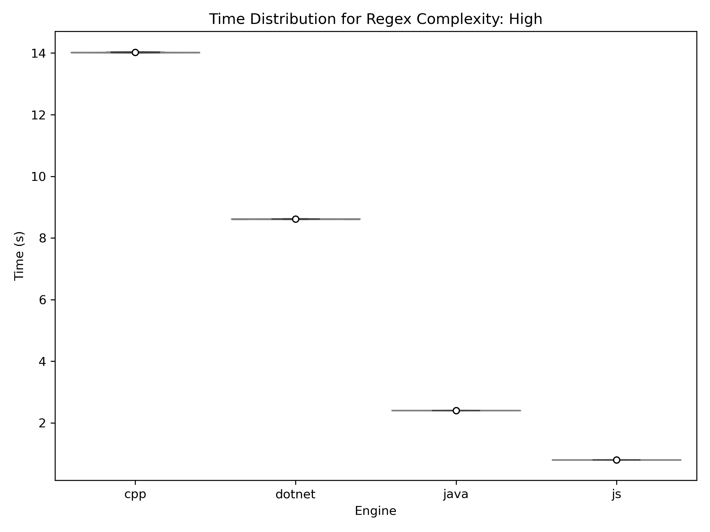

# Comparing Energy Consumption of Popular RegEx Engines in IDEs and Text Editors
This repository is home to the Project 1 source code of Group 1, for the 2025 edition of [Sustainable Software Engineering](https://luiscruz.github.io/course_sustainableSE/2025/) course at TU Delft. The core purpose of this source code is to analyse Energy Consumption of Regular Expression (RegEx) engines, commonly used by modern IDEs and text editors.

By utilising this repository you should be able to replicate our study.

## Table of Contents
- [Setup Environment](#setup-environment)
  * [Using venv (Virtual Environment)](#using-venv-virtual-environment)
  * [Using Conda](#using-conda)
- [Environment Variables](#environment-variables)
- [Corpus Data](#corpus-data)
- [Verify the different RegEx Engines work](#verify-the-different-regex-engines-work)
  * [Find what is missing](#find-what-is-missing)
  * [Install Java Development Kit (JDK)](#install-java-development-kit-jdk)
  * [Install C++ compiler & Boost-Regex](#install-c-compiler--boost-regex)
  * [Install Node.js](#install-nodejs)
  * [Install .NET](#install-net)
- [Run the experiment](#run-the-experiment)
- [Visualisation of Results](#visualisation-of-results)
- [Authors](#authors)
 

## Setup Environment
0. Clone this repository:
   ```bash
   git clone https://github.com/ianjoshi/regex-energy.git
   cd regex-energy
   ```

1. Set up Python environment (choose one method):

   ### Using venv (Virtual Environment)
   ```bash
   # Create and activate virtual environment
   python -m venv venv
   source venv/bin/activate  # On Windows use: venv\Scripts\activate
   
   # Install dependencies
   pip install -r requirements.txt
   ```

   ### Using Conda
   ```bash
   # Create and activate conda environment
   conda env create -f environment.yml
   conda activate regex_energy_experiment
   ```

## Environment Variables
To run the experiment, you need to set the following environment variables:
- `ENERGIBRIDGE_DRIVER_PATH`: Path to the Energibridge driver. This is required for the energy measurements.
- `BOOST_PATH`: Path to the Boost library. This is required for the C++ Boost RegEx engine. Details on how to download Boost-Regex are provided in the [Verify the different RegEx Engines work](#verify-the-different-regex-engines-work) section.

You can set these environment variables by renaming the `.env.template` file to `.env` in the root directory of the project and filling in the following lines:

```bash
ENERGIBRIDGE_DRIVER_PATH="<PROJECT_ROOT>\energibridge\LibreHardwareMonitor.sys"
BOOST_PATH="<BOOST_PATH>"
```

**NOTE**: The BOOST_PATH should contain forward slashes in its path (i.e. `/` instead of `\`).

## Corpus Data
To download the corpus data where the engine will run the regex pattern on, `corpus_generator.py` has a variable that takes URLs and downloads the raw code contents. By default, the URLs are set to download the code from the [Numpy multiarray test](https://raw.githubusercontent.com/numpy/numpy/refs/heads/main/numpy/_core/tests/test_multiarray.py). This file is then amplified to create a larger corpus of 100MB, so that the RegEx engines take longer to run and we can better measure the energy consumption.

**Note**: The corpus data is not included in the repository, due to the large size of the file (100MB). To generate it, run the `corpus_generator.py` script. The corpus data will be stored in the `data/` directory.

## Verify the different RegEx Engines work
Ensure you are able to run Java, Node.js, C++, and .NET files from this directory on your computer using the following steps.

### Find what is missing
Run the test file to check if all engines are working:
```bash
python test_regex_engines.py
```

**Note**: You may notice in the `test_regex_engines.py` that the following code snippet has comments 'Depends on compiler' and 'Depends on vcpkg installation path'. 
```python
    def test_boost_engine_pipe_interaction(self):
        # Get Boost path from environment
        load_dotenv()
        boost_path = os.getenv("BOOST_PATH") # Depends on vcpkg installation path
        if not boost_path:
            raise ValueError("BOOST_PATH environment variable not set")
        
        # Print the directory contents to debug
        print("Checking library directory:")
        subprocess.run(["dir", f"{boost_path}/lib"], shell=True)
        
        compile_result = subprocess.run([
            "g++", # Depends on compiler
            f"{self.factory.directory_to_store_engines}/regex_matcher.cpp",
            "-o", f"{self.factory.directory_to_store_engines}/regex_matcher.exe",
            f"-I{boost_path}/include",
            f"-L{boost_path}/lib",
            "-Wl,-rpath," + boost_path + "/bin",
            "-lboost_regex-vc143-mt-x64-1_86",  # Depends on compiler
            "--verbose"
        ], capture_output=True, text=True)

        # Rest of function
```

These lines you might have to adjust based on the system you're running the script on.

### Install Java Development Kit (JDK)
* Windows: https://docs.oracle.com/en/java/javase/22/install/installation-jdk-microsoft-windows-platforms.html

* macOS: https://docs.oracle.com/en/java/javase/22/install/installation-jdk-macos.html

* Linux: https://docs.oracle.com/en/java/javase/22/install/installation-jdk-linux-platforms.html


### Install C++ compiler & Boost-Regex
You have a few options in terms of the compiler you choose to install here. This will affect the exact installation of the boost-regex library.

**Compilers:**

* TDM-GCC: https://jmeubank.github.io/tdm-gcc/download/

* MSVC: https://learn.microsoft.com/en-us/cpp/windows/latest-supported-vc-redist?view=msvc-170


**VCPKG:**

Install:
```bash
cd C:\dev
git clone https://github.com/Microsoft/vcpkg.git
cd vcpkg
.\bootstrap-vcpkg.bat
```

*For windows:* Add to path by running Powershell as Administrator:
```bash
[Environment]::SetEnvironmentVariable(
    "Path",
    [Environment]::GetEnvironmentVariable("Path", "Machine") + ";C:\path\to\vcpkg",
    "Machine"
)
```

*For Linux/macOS:* Add to path by adding this line to your shell configuration file (~/.bashrc, ~/.zshrc, etc.):
```bash
export PATH=$PATH:/path/to/vcpkg
```

Then reload your shell configuration:
```bash
source ~/.bashrc  # If using bash
# OR
source ~/.zshrc   # If using zsh
```

Test if it works in a new terminal window:
```
vcpkg version
```

**Boost-Regex:**

If TDM-GCC is compiler: run 
```bash 
vcpkg install boost-regex:x64-mingw-dynamic
```

### Install Node.js
Go to: https://nodejs.org/en/download

### Install .NET
Go to: https://dotnet.microsoft.com/en-us/download

## Run the experiment
First, run the `corpus_generator.py` script to generate the corpus data:
```bash
python corpus_generator.py
```

Then, after making sure you followed all the steps described above, you should run your IDE as an **Administrator** and put your computer in "Zen Mode", which is described by the following steps:

```md
1. Close all unnecessary applications.
2. Kill unnecessary services.
3. Turn off notifications.
4. Disconnect any unnecessary hardware.
5. Disconnect Wi-Fi.
6. Switch off auto-brightness on your display.
7. Set room temperature (if possible) to 25°C. Else stabilize room temperature if possible.
```


Finally, you can run the experiment by running:
```bash
python main.py
```

When running `main.py`, the results and visualisations will be generated in the `results/` directory.

## Visualisation of Results

<table>
  <tr>
    <th>Low Complexity Energy</th>
    <th>Low Complexity Time</th>
  </tr>
  <tr>
    <td></td>
    <td></td>
  </tr>
</table>

<table>
  <tr>
    <th>Medium Complexity Energy</th>
    <th>Medium Complexity Time</th>
  </tr>
  <tr>
    <td></td>
    <td></td>
  </tr>
</table>

<table>
  <tr>
    <th>High Complexity Energy</th>
    <th>High Complexity Time</th>
  </tr>
  <tr>
    <td></td>
    <td></td>
  </tr>
</table>

## Authors

- **Marina Escribano Esteban**
- **Kevin Hoxha**
- **Inaesh Joshi**
- **Todor Mladenović**
